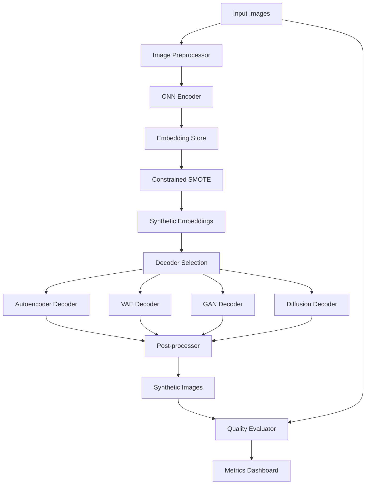

# Design Document

## Overview

The SMOTE-based synthetic image generation system implements a three-stage pipeline: encoding images to embeddings, applying constrained SMOTE in the embedding space, and decoding synthetic embeddings back to images. The design addresses key challenges including decoder quality, embedding space properties, and the quality-diversity trade-off through modular architecture and multiple decoder options.

## Architecture

### High-Level Architecture



### Component Architecture

The system follows a modular design with clear separation of concerns:

1. **Encoding Pipeline**: Handles image preprocessing and embedding generation
2. **SMOTE Engine**: Applies constrained synthetic oversampling in embedding space
3. **Decoder Factory**: Manages multiple decoder architectures
4. **Quality Assessment**: Evaluates synthetic image quality and diversity
5. **Configuration Manager**: Handles pipeline configuration and parameter validation

## Components and Interfaces

### 1. Image Encoder Component

**Purpose**: Convert input images to meaningful embeddings using CNN architectures.

**Interface**:
```python
class ImageEncoder:
    def __init__(self, architecture: str, embedding_dim: int, pretrained: bool = True)
    def encode(self, images: torch.Tensor) -> torch.Tensor
    def encode_batch(self, image_batch: List[torch.Tensor]) -> torch.Tensor
    def validate_input_format(self, image_path: str) -> Tuple[bool, str]
    def get_embedding_dim(self) -> int
    def save_model(self, path: str) -> None
    def load_model(self, path: str) -> None
```

**Supported Architectures**:
- ResNet variants (ResNet18, ResNet50, ResNet101)
- EfficientNet family
- Vision Transformer (ViT)
- Custom CNN architectures

**Design Decisions**:
- Use pretrained models for better semantic representations
- Support variable embedding dimensions (128, 256, 512, 1024)
- Implement feature pyramid extraction for multi-scale representations
- Include batch normalization and dropout for regularization

### 2. Constrained SMOTE Engine

**Purpose**: Generate synthetic embeddings with constraints to ensure validity.

**Interface**:
```python
class ConstrainedSMOTE:
    def __init__(self, k_neighbors: int = 5, sampling_strategy: str = 'auto')
    def fit(self, embeddings: np.ndarray, labels: np.ndarray) -> None
    def generate_synthetic(self, n_samples: int) -> Tuple[np.ndarray, np.ndarray]
    def validate_embedding_space(self, embeddings: np.ndarray) -> bool
    def validate_parameters(self) -> Tuple[bool, List[str]]
    def apply_clustering_constraint(self, embeddings: np.ndarray) -> np.ndarray
    def detect_near_duplicates(self, embeddings: np.ndarray, threshold: float = 0.01) -> np.ndarray
    def normalize_embedding_space(self, embeddings: np.ndarray) -> np.ndarray
```

**Constraints Implementation**:
- **Semantic Clustering**: Apply K-means clustering before SMOTE to ensure interpolation occurs within semantic groups
- **Distance Thresholding**: Only interpolate between embeddings within a maximum distance threshold
- **Boundary Detection**: Identify and respect class boundaries in embedding space
- **Validity Checking**: Validate synthetic embeddings against learned embedding distribution

### 3. Multi-Decoder Architecture

**Purpose**: Provide multiple decoding strategies with different quality-speed trade-offs.

#### Autoencoder Decoder
```python
class AutoencoderDecoder:
    def __init__(self, embedding_dim: int, image_shape: Tuple[int, int, int])
    def decode(self, embeddings: torch.Tensor) -> torch.Tensor
    def train_decoder(self, embeddings: torch.Tensor, images: torch.Tensor) -> None
```

**Architecture**: 
- Progressive upsampling with skip connections
- Feature pyramid network structure
- Perceptual loss integration

#### VAE Decoder
```python
class VAEDecoder:
    def __init__(self, embedding_dim: int, latent_dim: int, image_shape: Tuple[int, int, int])
    def decode(self, embeddings: torch.Tensor) -> torch.Tensor
    def sample_latent(self, embeddings: torch.Tensor) -> torch.Tensor
```

**Architecture**:
- Probabilistic latent space modeling
- KL divergence regularization
- Reparameterization trick for stable training

#### GAN-Based Decoder
```python
class GANDecoder:
    def __init__(self, embedding_dim: int, image_shape: Tuple[int, int, int])
    def decode(self, embeddings: torch.Tensor) -> torch.Tensor
    def train_adversarial(self, embeddings: torch.Tensor, real_images: torch.Tensor) -> None
```

**Architecture**:
- Progressive GAN structure
- Spectral normalization for training stability
- Feature matching loss for better convergence

#### Diffusion Decoder
```python
class DiffusionDecoder:
    def __init__(self, embedding_dim: int, image_shape: Tuple[int, int, int], timesteps: int = 1000)
    def decode(self, embeddings: torch.Tensor) -> torch.Tensor
    def denoise_step(self, noisy_image: torch.Tensor, timestep: int, embedding: torch.Tensor) -> torch.Tensor
```

**Architecture**:
- U-Net backbone with attention mechanisms
- Embedding conditioning at multiple scales
- DDPM/DDIM sampling strategies

### 4. Quality Assessment Module

**Purpose**: Evaluate synthetic image quality and provide feedback for parameter tuning.

**Interface**:
```python
class QualityAssessor:
    def __init__(self, metrics: List[str] = ['fid', 'lpips', 'ssim'])
    def evaluate_quality(self, synthetic_images: torch.Tensor, real_images: torch.Tensor) -> Dict[str, float]
    def compute_diversity_metrics(self, synthetic_images: torch.Tensor) -> Dict[str, float]
    def generate_report(self, metrics: Dict[str, float]) -> str
    def check_quality_thresholds(self, metrics: Dict[str, float]) -> Tuple[bool, List[str]]
    def recommend_parameter_adjustments(self, metrics: Dict[str, float]) -> Dict[str, Any]
```

**Metrics Implementation**:
- **FID (Fréchet Inception Distance)**: Measures distribution similarity
- **LPIPS (Learned Perceptual Image Patch Similarity)**: Perceptual similarity
- **SSIM (Structural Similarity Index)**: Structural similarity
- **Diversity Score**: Intra-class and inter-class diversity measures
- **Reconstruction Loss**: Pixel-level and feature-level reconstruction accuracy

## Data Models

### Embedding Data Model
```python
@dataclass
class EmbeddingData:
    embedding: np.ndarray
    label: int
    source_image_id: str
    metadata: Dict[str, Any]
    timestamp: datetime
    
    def validate(self) -> bool:
        return self.embedding.shape[0] > 0 and self.label >= 0
```

### Synthetic Sample Data Model
```python
@dataclass
class SyntheticSample:
    synthetic_embedding: np.ndarray
    generated_image: np.ndarray
    parent_embeddings: List[str]  # IDs of source embeddings used in interpolation
    interpolation_weights: np.ndarray
    quality_score: float
    decoder_type: str
    generation_timestamp: datetime
```

### Configuration Data Model
```python
@dataclass
class PipelineConfig:
    encoder_config: EncoderConfig
    smote_config: SMOTEConfig
    decoder_config: DecoderConfig
    quality_config: QualityConfig
    config_name: str
    creation_timestamp: datetime
    
    def validate(self) -> Tuple[bool, List[str]]:
        # Validation logic for configuration consistency
        pass
    
    def save_config(self, path: str) -> None:
        # Save configuration to file for reuse
        pass
    
    @classmethod
    def load_config(cls, path: str) -> 'PipelineConfig':
        # Load configuration from file
        pass
```

## Error Handling

### Embedding Space Validation
- **Invalid Embedding Detection**: Check for NaN, infinity, or out-of-range values
- **Dimensionality Mismatch**: Ensure consistent embedding dimensions across pipeline
- **Distribution Drift**: Monitor embedding distribution changes over time

### Decoder Error Handling
- **Reconstruction Failure**: Fallback to simpler decoder architectures
- **Memory Overflow**: Implement batch processing and memory management
- **Quality Degradation**: Automatic parameter adjustment based on quality metrics

### SMOTE Constraint Violations
- **Sparse Data Handling**: Apply clustering or increase k-neighbors automatically
- **Boundary Violations**: Implement embedding space clipping and normalization
- **Class Imbalance**: Adaptive sampling strategies based on class distribution

## Testing Strategy

### Unit Testing
- **Component Isolation**: Test each component independently with mock data
- **Interface Validation**: Verify all interfaces conform to specifications
- **Edge Case Handling**: Test boundary conditions and error scenarios

### Integration Testing
- **Pipeline Flow**: Test complete pipeline with synthetic datasets
- **Decoder Comparison**: Compare outputs across different decoder architectures
- **Quality Metrics**: Validate quality assessment accuracy

### Performance Testing
- **Memory Usage**: Monitor memory consumption during batch processing
- **Processing Speed**: Benchmark encoding, SMOTE, and decoding performance
- **Scalability**: Test with varying dataset sizes and embedding dimensions

### Quality Validation Testing
- **Visual Inspection**: Manual review of generated images
- **Quantitative Metrics**: Automated quality score validation
- **Ablation Studies**: Test impact of different configuration parameters

## Implementation Considerations

### Memory Management
- Implement streaming processing for large datasets
- Use memory-mapped files for embedding storage
- Implement gradient checkpointing for large models

### Computational Efficiency
- GPU acceleration for all neural network components
- Parallel processing for SMOTE operations
- Model quantization for deployment optimization

### Extensibility
- Plugin architecture for new decoder types
- Configurable quality metrics
- Support for custom CNN architectures

### Monitoring and Logging
- Comprehensive logging for debugging and optimization
- Real-time quality monitoring during generation
- Performance metrics collection and analysis